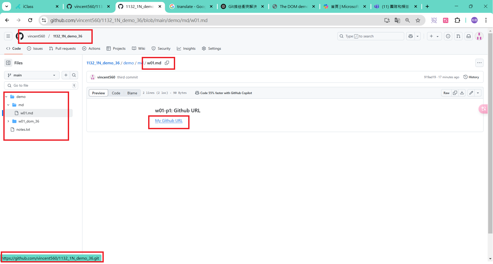
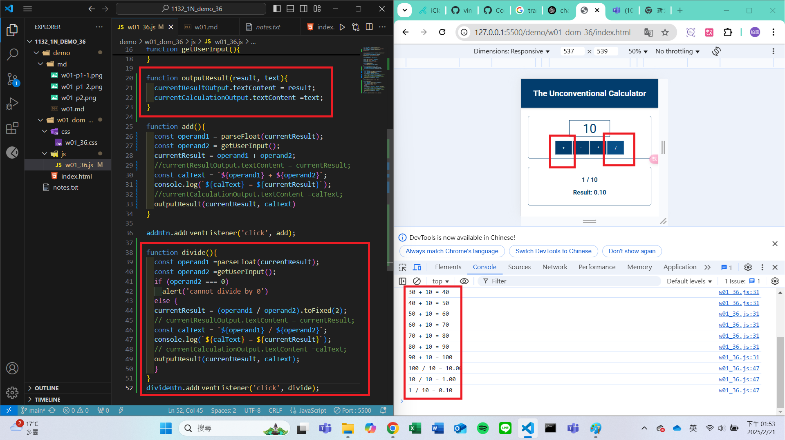
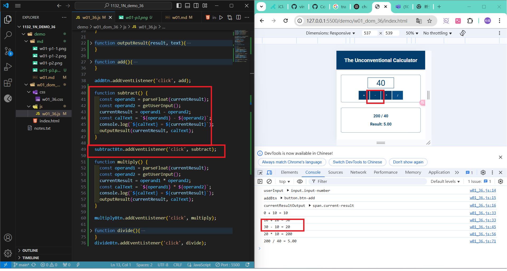
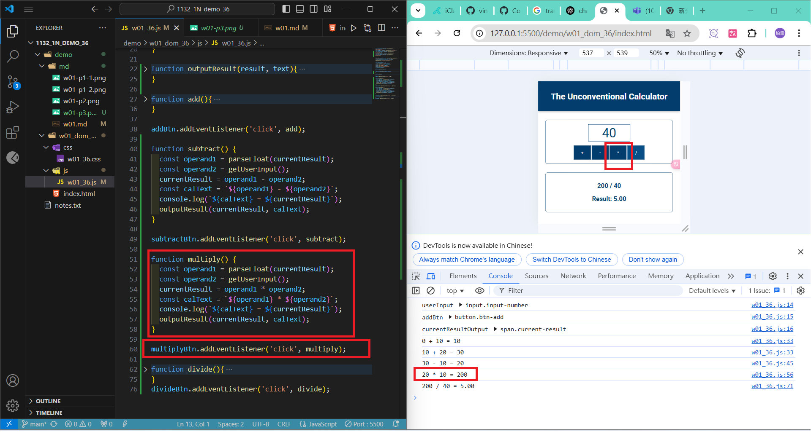

### w01-p1: Github URL
[My Github URL](https://github.com/vincent560/1132_1N_demo_36.git)
#### => Github repo
 

 
#### => share to teacher and TA
 

#### =>W01-P2: implement add button
 

#### =>W01-P3: implement divide button
 

### W01-P4: implement subtract button
 

 
### W01-P5: implement multiply button
 

### W01-logs: git logs of W01
 
