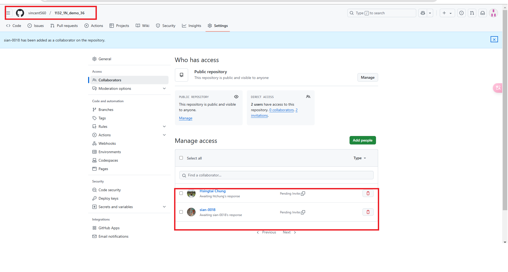
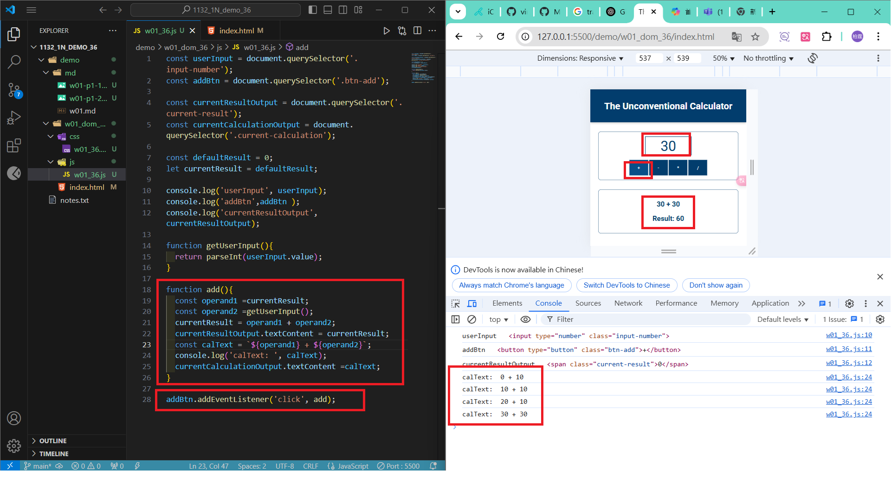
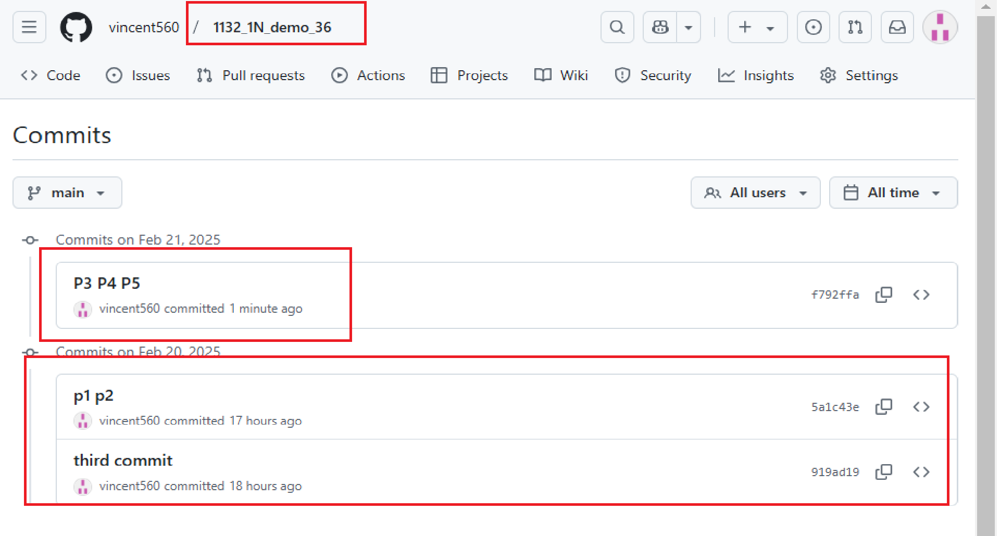

### w01-p1: Github URL
[My Github URL](https://github.com/vincent560/1132_1N_demo_36.git)
#### => Github repo
 

```
919ad19 vincent560      Thu Feb 20 19:32:23 2025 +0800  third commit
```
 
#### => share to teacher and TA
 


#### =>W01-P2: implement add button
 

```
5a1c43e vincent560      Thu Feb 20 20:33:20 2025 +0800  p1 p2
```

#### =>W01-P3: implement divide button
 


### W01-P4: implement subtract button
 

 
### W01-P5: implement multiply button
 

```
f792ffa vincent560      Fri Feb 21 14:13:53 2025 +0800  P3 P4 P5
```

### W01-logs: git logs of W01
 
