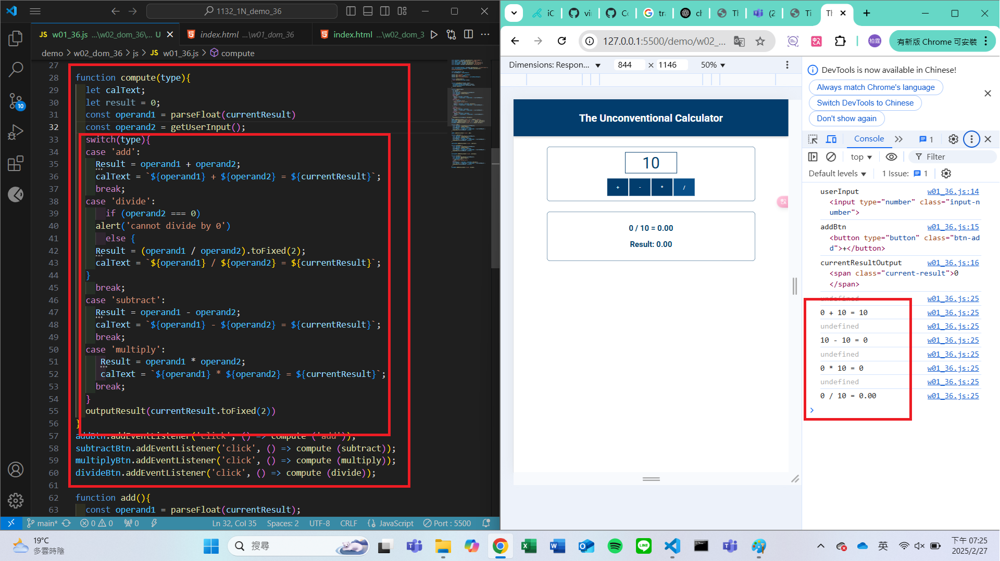
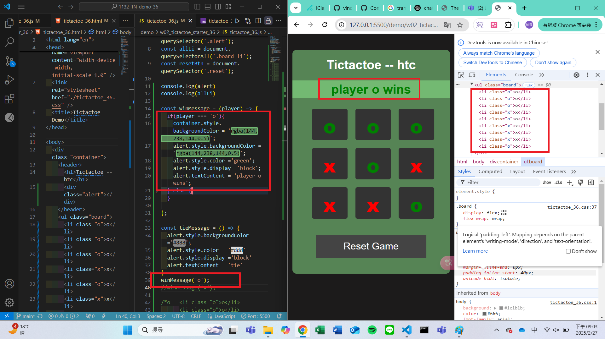
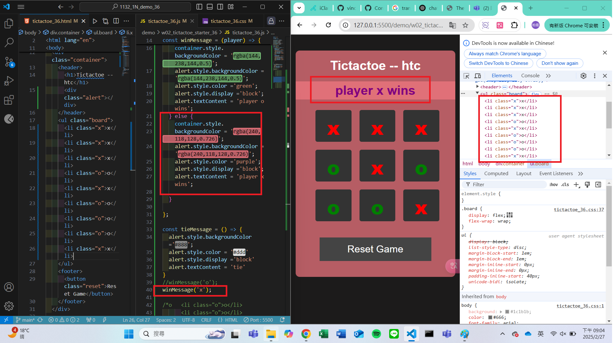
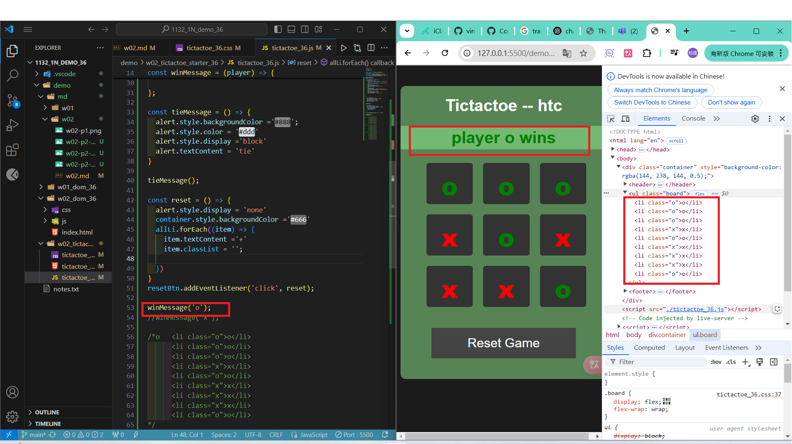
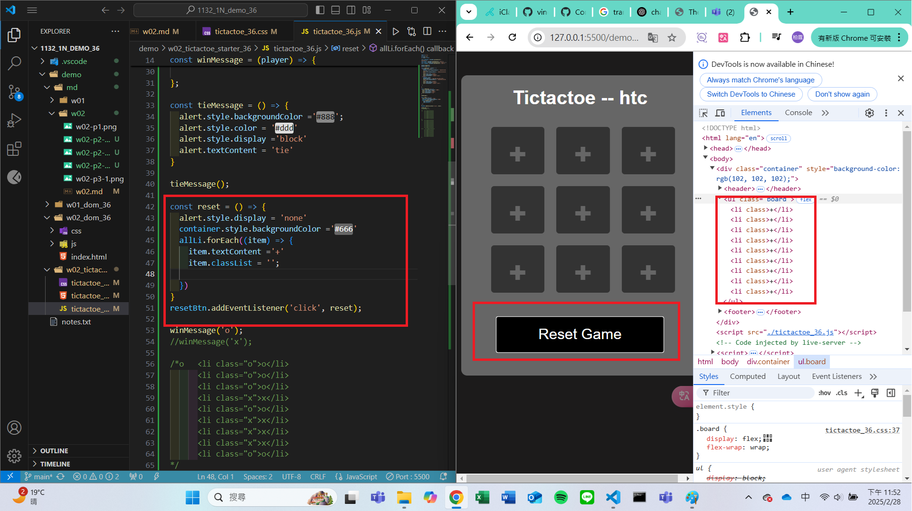

#### Github URL
[My Github URL](https://github.com/vincent560/1132_1N_demo_36.git)
#### W02-P1: refine the code in week 1 using ony one compute function

````
6cc4f62 vincent560      Thu Feb 27 19:30:20 2025 +0800   W02-P1: refine the code in week 1 using ony one compute function
````
#### W02-P2: show winning message and tie message

#### ==> play o wins



#### ==> play x wins



#### ==> tie


#### W02-P3: implement reset button
 
#### ==> initially player o win
 

 
#### ==> after reset button is pressed
 
