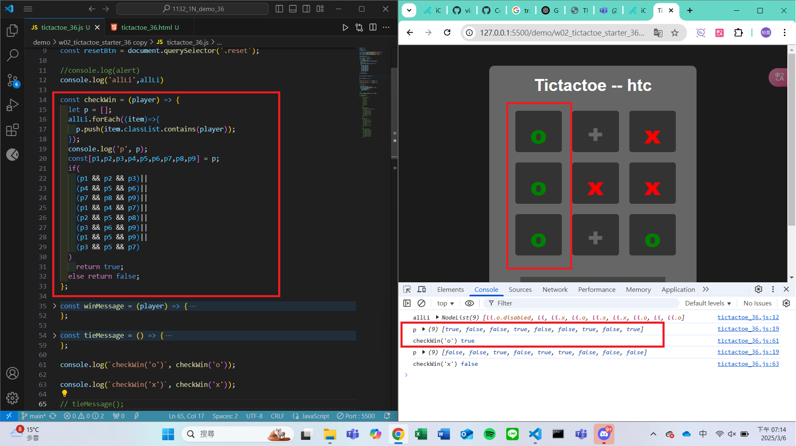
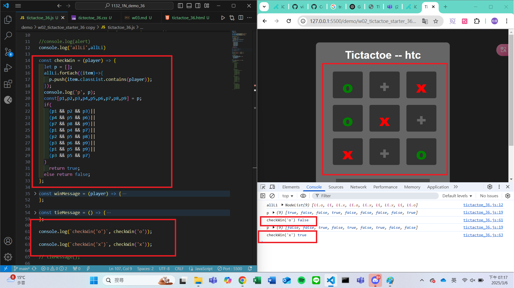
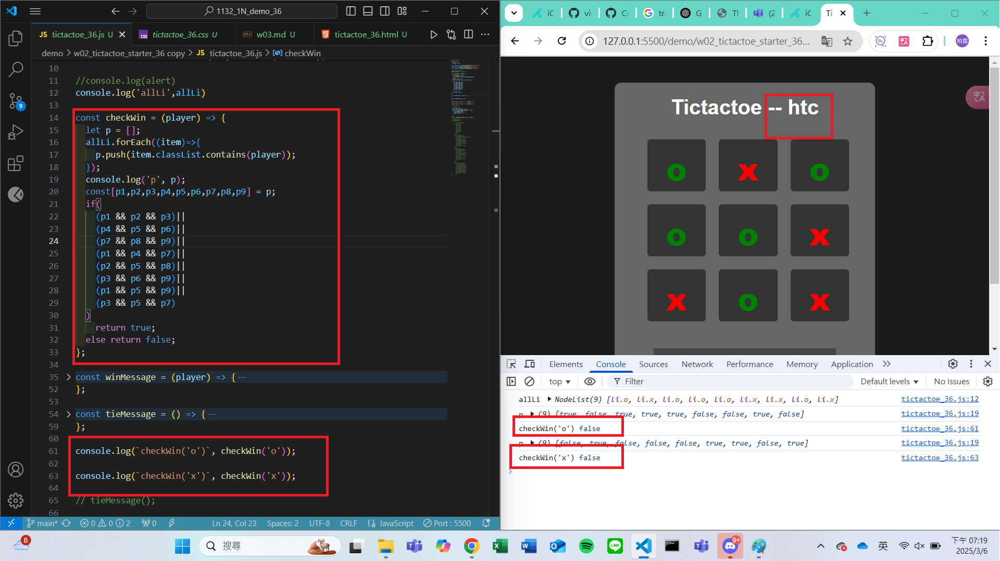

#### Github URL
[My Github URL](https://github.com/vincent560/1132_1N_demo_36.git)
#### W03-P1: Implement checkWin(player) using three different cases
 
#### => player o wins
 

 
#### => player x wins
 

 
#### => no player wins
 

 