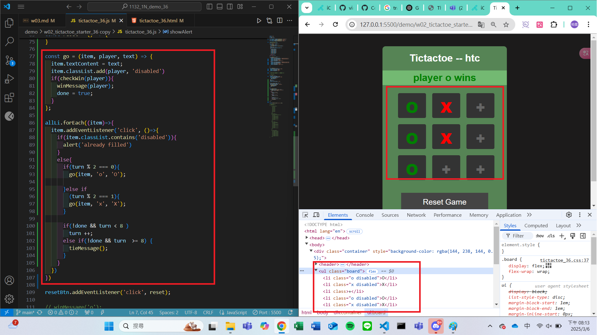
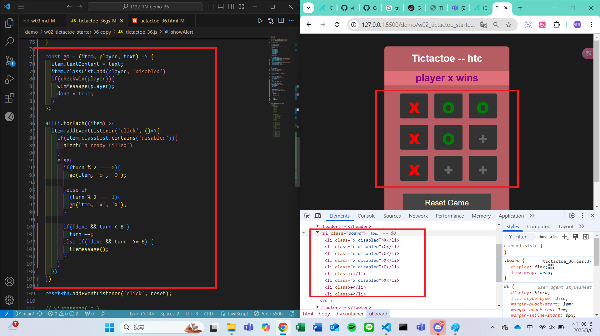
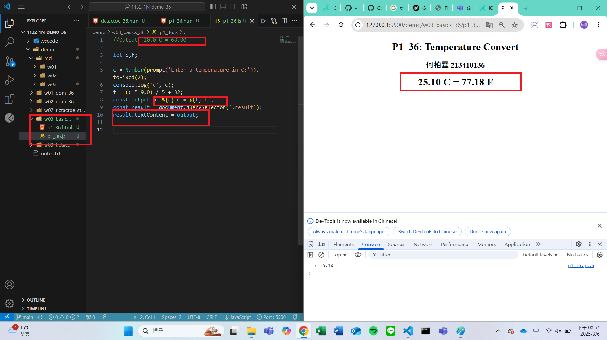
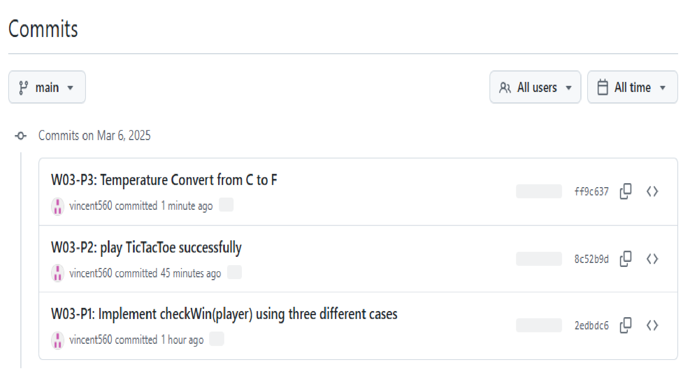

#### Github URL
[My Github URL](https://github.com/vincent560/1132_1N_demo_36.git)
#### W03-P1: Implement checkWin(player) using three different cases
 
#### => player o wins
 

 
#### => player x wins
 

 
#### => no player wins
 

 
```
2edbdc6 vincent560      Thu Mar 6 19:21:03 2025 +0800   W03-P1: Implement checkWin(player) using three different cases
```
#### W03-P2: play TicTacToe successfully
 
#### => player o wins
 

 
#### => player x wins
 

 
#### => tie
 


```
8c52b9d vincent560      Thu Mar 6 20:19:07 2025 +0800   W03-P2: play TicTacToe successfully
```

####　W03-P3: Temperature Convert from C to F
 


```
ff9c637 vincent560      Thu Mar 6 21:03:24 2025 +0800   W03-P3: Temperature Convert from C to F
```
#### W03-logs: git logs of W03

