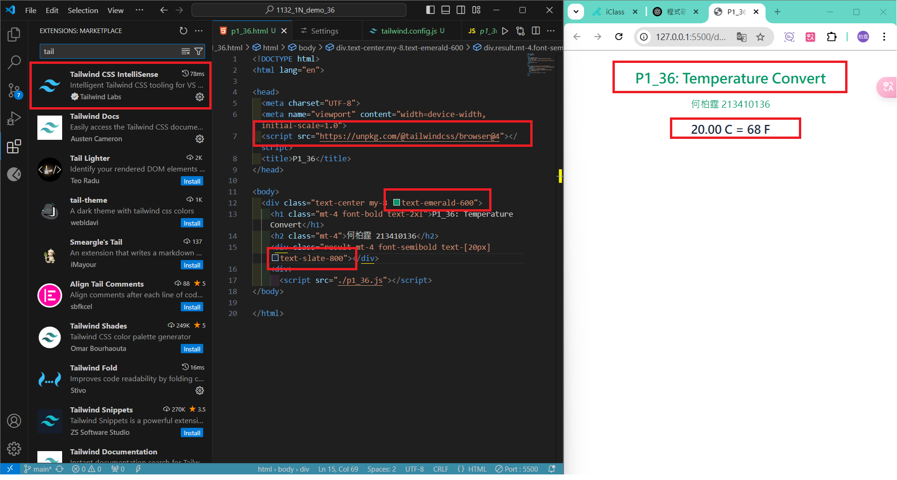
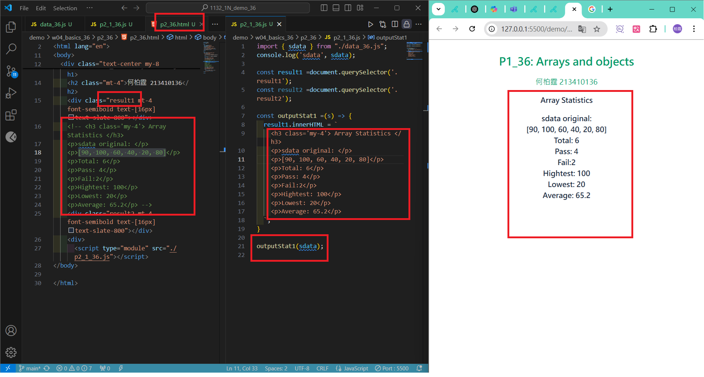
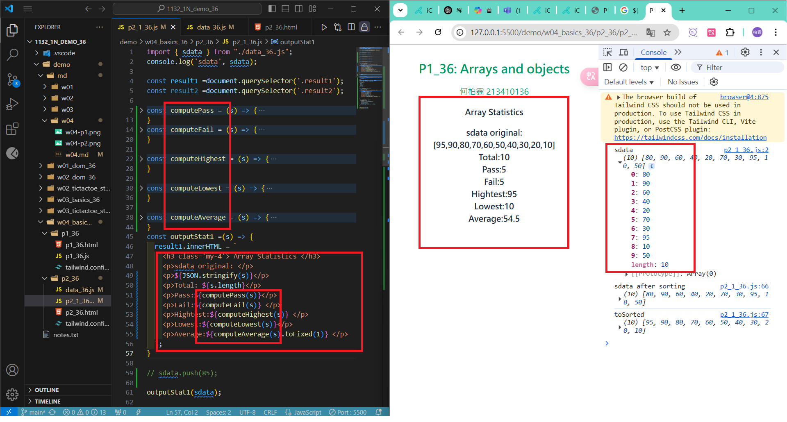

#### Github URL
[My Github URL](https://github.com/vincent560/1132_1N_demo_36.git)
#### W04-P1: Setup tailwindcss for p1_36.html
 


````
bf6b593 vincent560      Thu Mar 13 18:51:09 2025 +0800  W04-P1: Setup tailwindcss for p1_36.html
````
#### W04-P2: create html code to show sdata original in js code
 

```
ebe3382 vincent560      Thu Mar 13 19:41:24 2025 +0800  W04-P2: create html code to show sdata original in js code
```
#### W04-P3: Show sdata statistics from js code
 


#### W04-P4: Show toSorted data and a stat object to store statistical data
 
