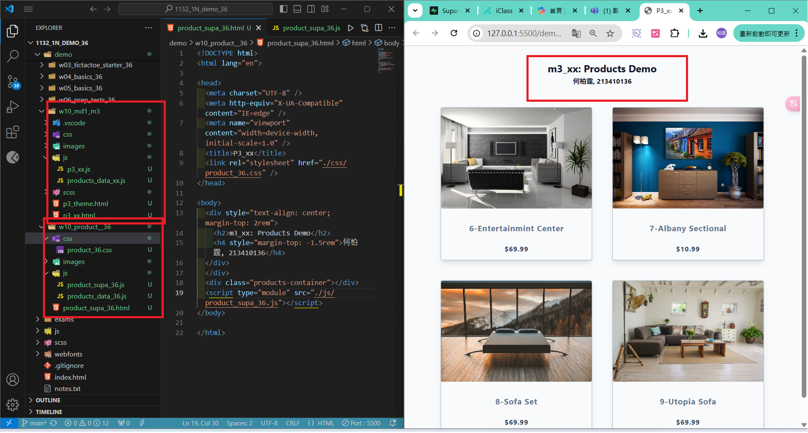
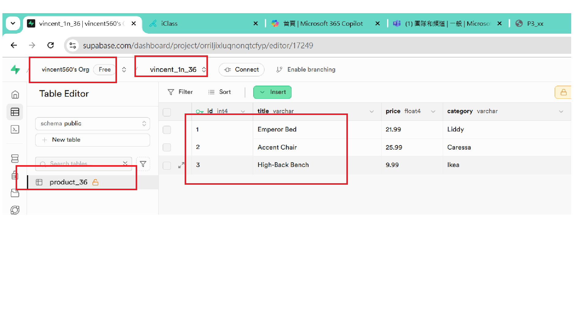
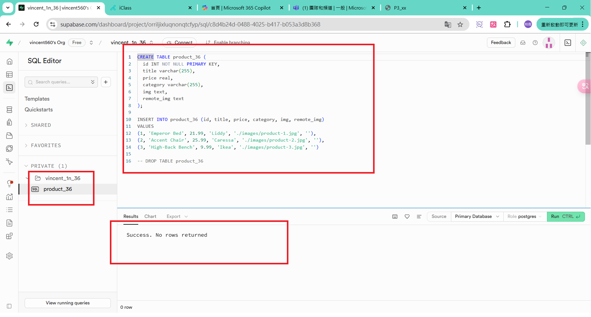
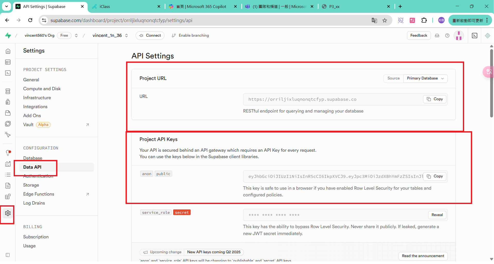
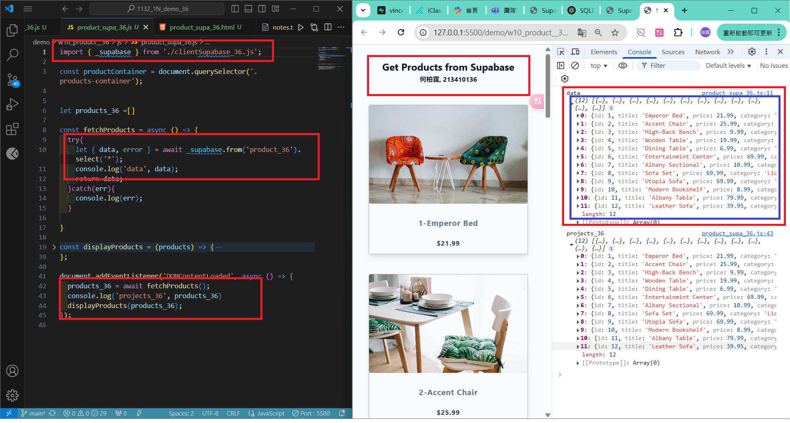
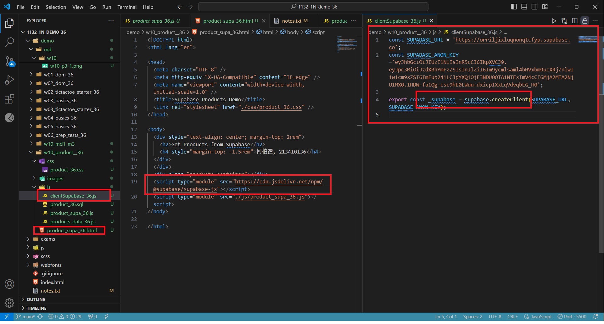
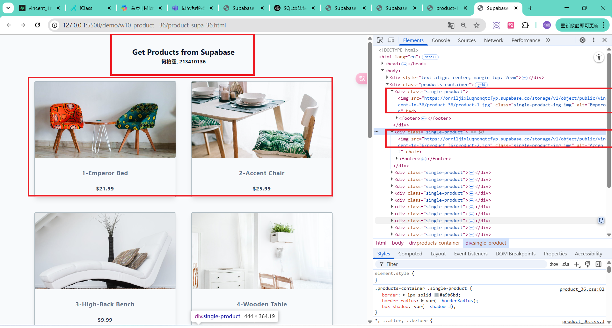
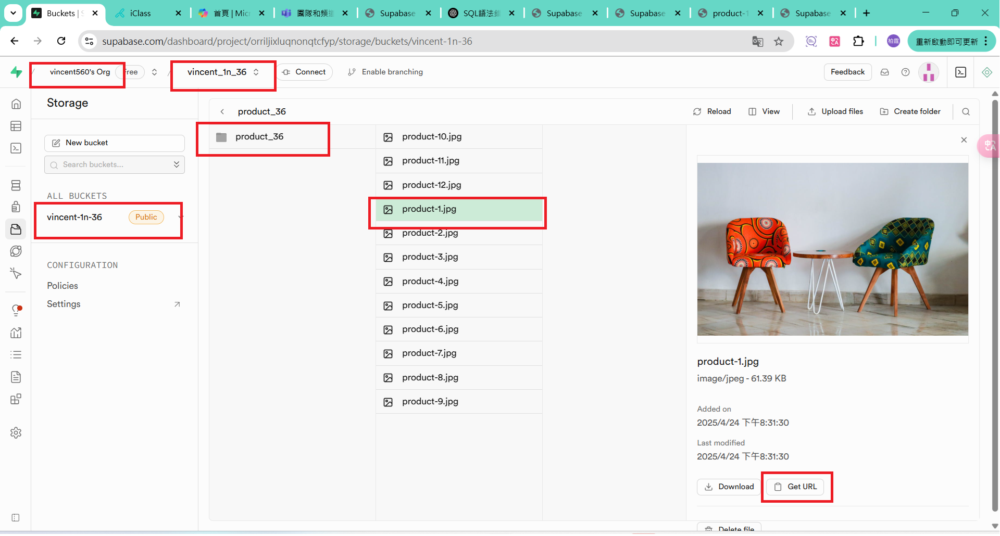
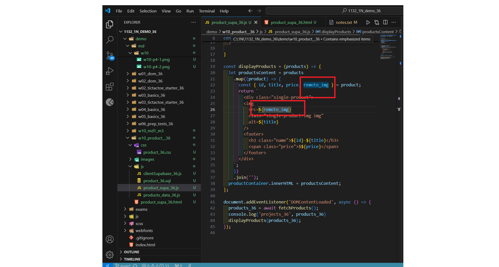

#### Github URL
[My Github URL](https://github.com/vincent560/1132_1N_demo_36.git)
#### W10-P1: Copy mid1 m3_xx answer and rearrange it for W10 demo

#### W10-P2: Setup Supabase with project yourcode_1n_xx
 
#### => show product_xx table with 3 data
 

 
#### => show SQL to create product_xx table and insert three data
 

 
#### => show Project URL and ANON KEY for this project
 

#### W10-P3: Get 12 products from Supabase
 
#### => show how to fetch products from Supabase
 

 
#### => Show how to get supabase-js to create supabase client
 

#### W10-P4: Upload 12 images to Supabase storage and show these remote images
 
#### => show the first two images are from Supabase storage
 

 
#### => show remote_img in product_xx table
 

 
#### => show the js code to use remote_img instead of img
 
