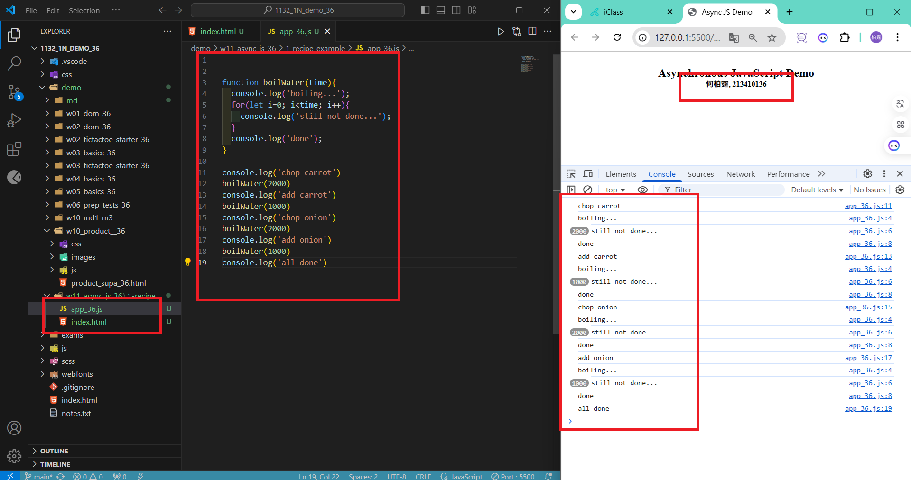
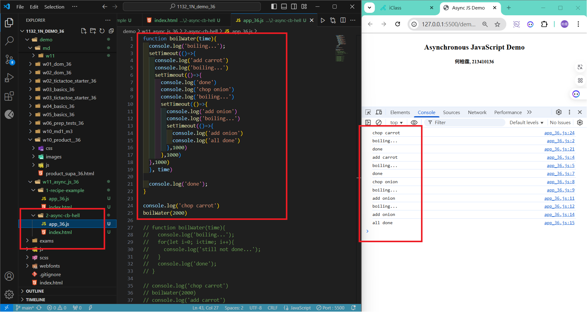
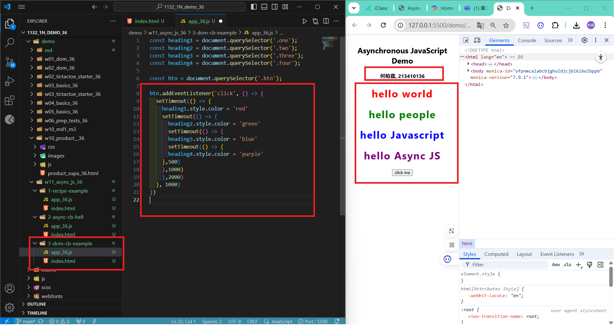
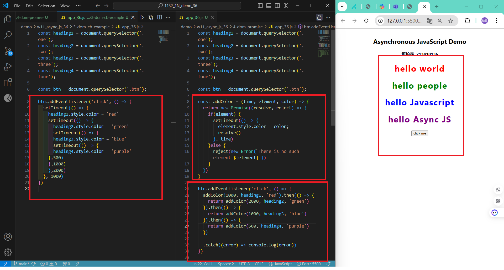
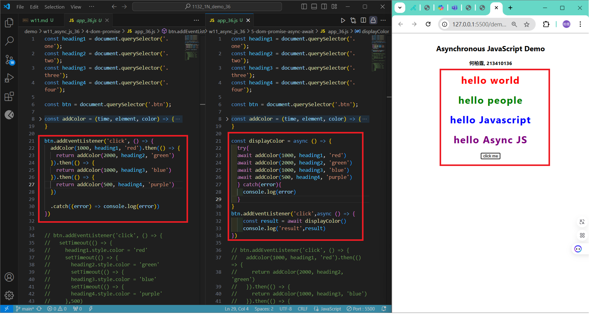
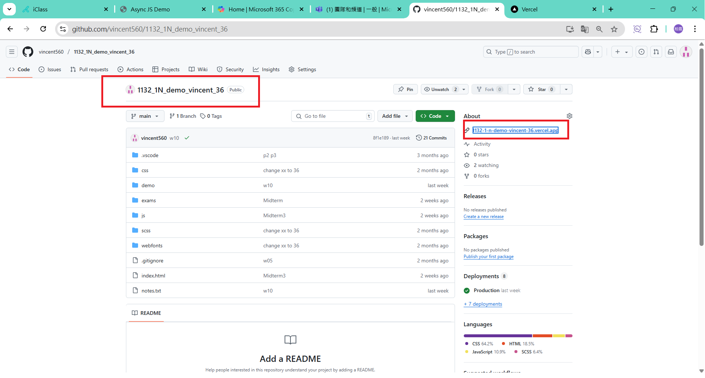
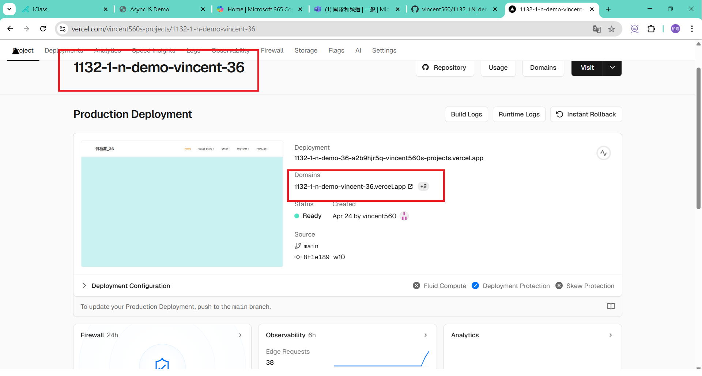
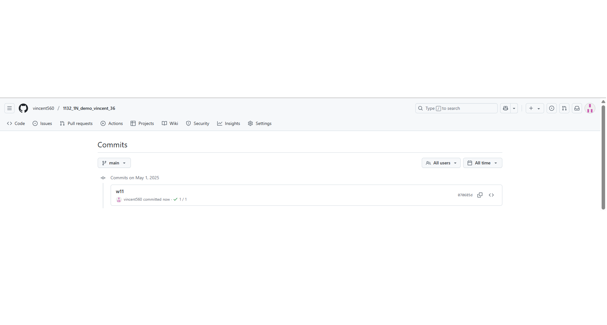

### w01-p1: Github URL
[My Github URL](https://github.com/vincent560/1132_1N_demo_36.git)
#### W11-P1: Synchronous vs. Asynchronous
 
#### => Synchronous demo
 

 
#### => Asynchronous demo
 

 
#### W11-P2: Asynchronous DOM demo
 


####　W11-P3: Use Promise to do W11-P2
 


#### W11-P4: Use Async Await to do W11-P3
 


#### W11-P5: Change Github repo name, and Vercel URL
 
#### => Github
 

 
#### => Vercel
 



#### => git log for w11



```
070685d vincent560      Thu May 1 20:54:36 2025 +0800   w11
```