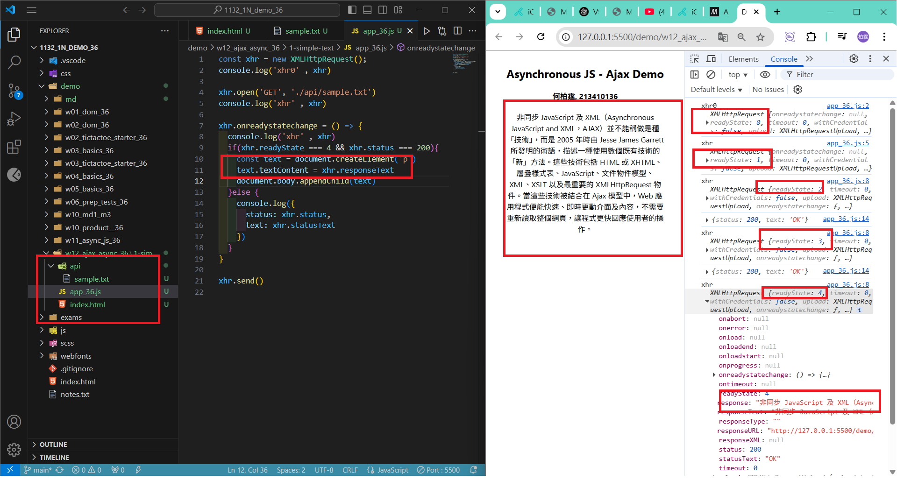
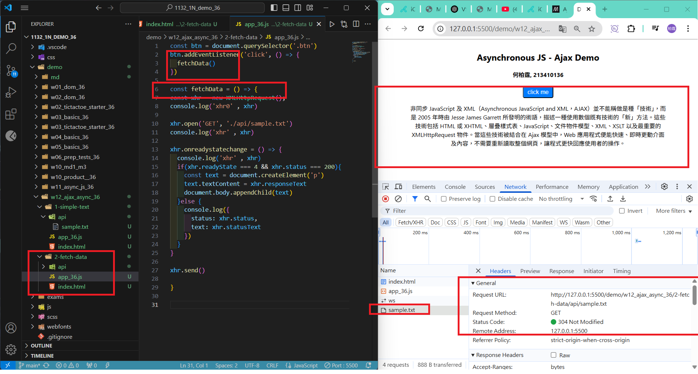
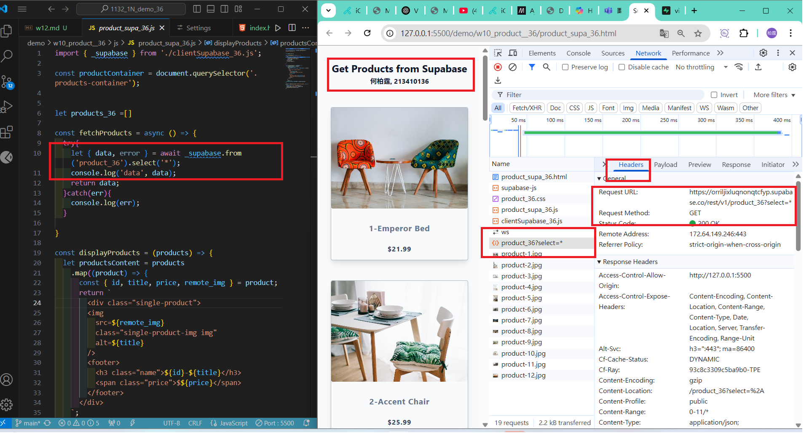
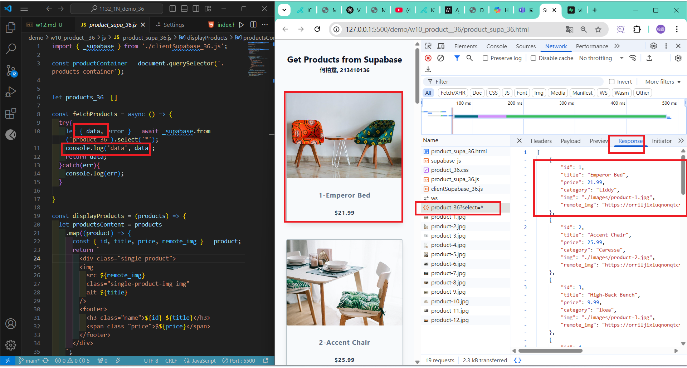
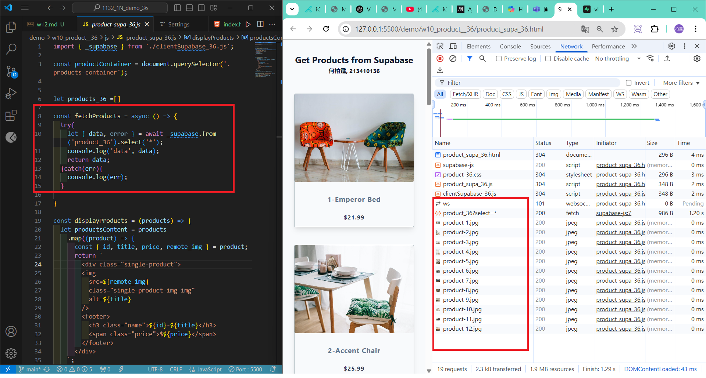
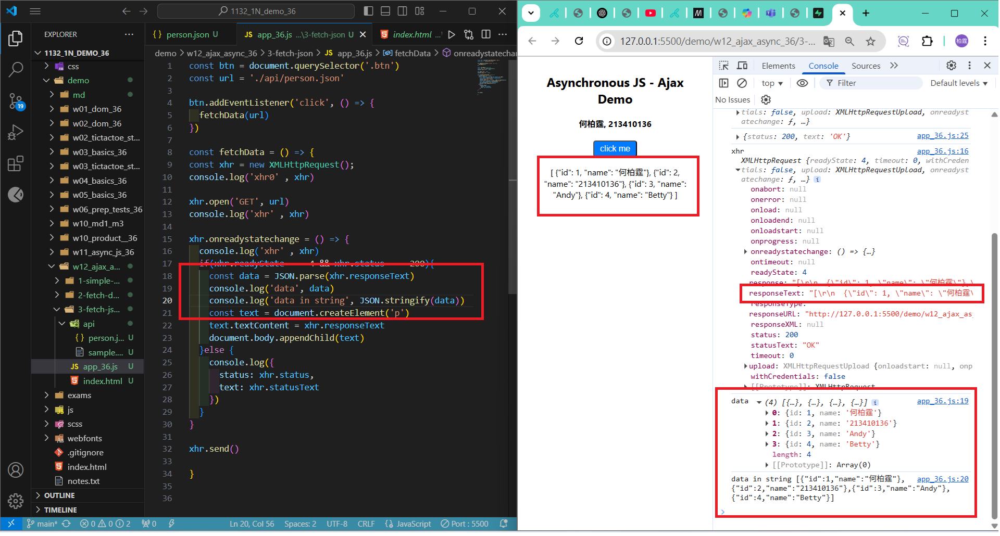
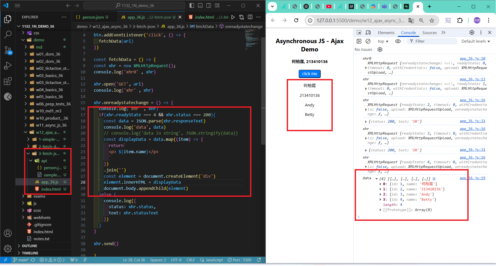
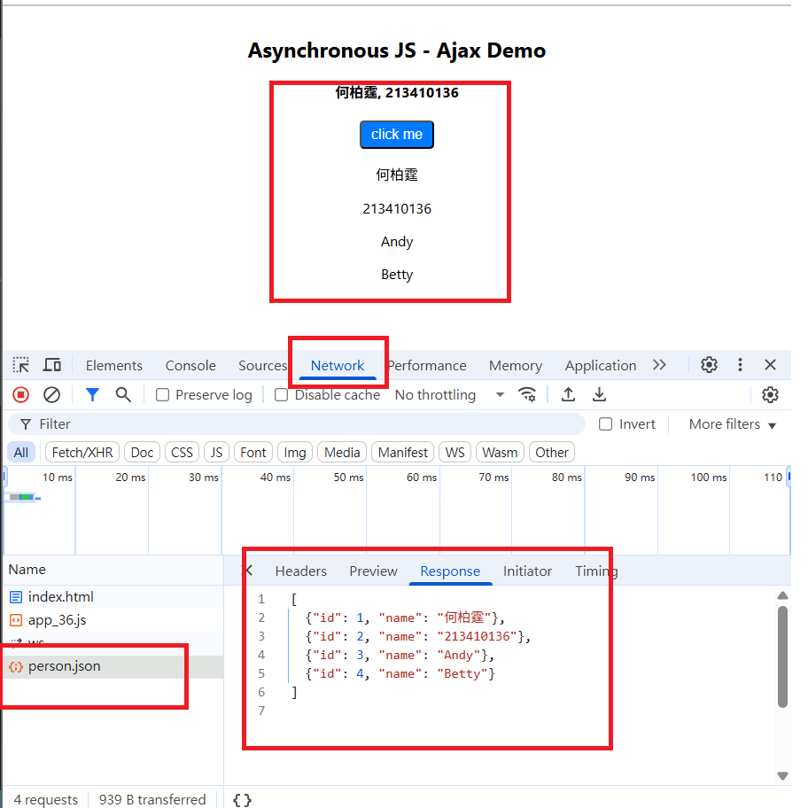
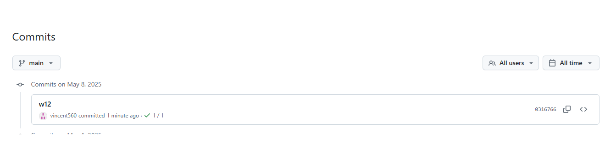

[My Github URL](https://github.com/vincent560/1132_1N_demo_36.git)

#### W12-P1: use xhr to display a simple text
 


#### W12-P2: click a button to fetch data
 


#### W12-P3: Run w10_product_supa_xx, see how it works
 
#### => \_supabase.from('product_xx').select('\*');
 

 
#### => check response
 

 
#### => check how many http requests being done in fetchProducts
 


#### W12-P4: Fetch person.json string and display name in the browser
 
#### => use JSON.parse() to convert responseText to JSON array
 

 
#### => extract name from data and show it in the browser
 

 
#### => check the Network, http response
 

 
````
0316766 vincent560      Thu May 8 20:43:32 2025 +0800   w12
````
#### => git log for w12



