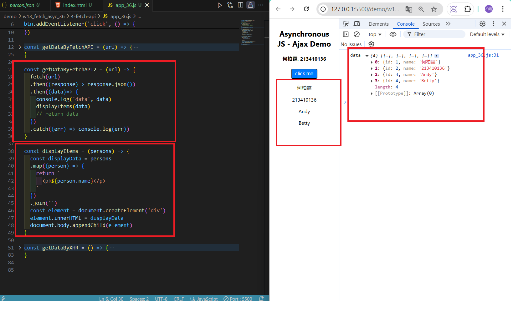
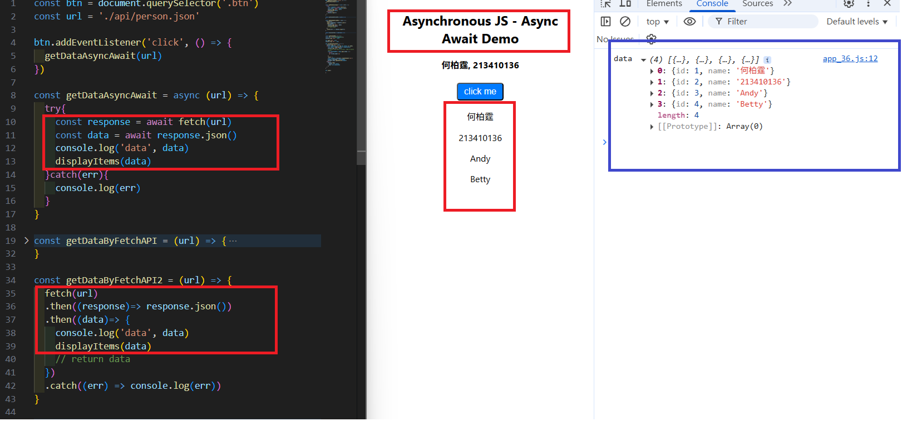
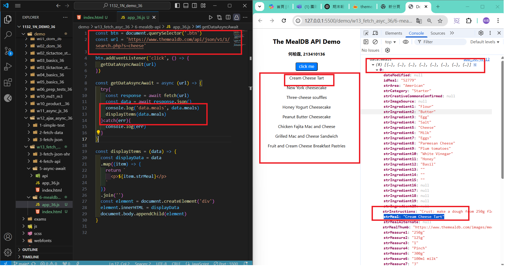
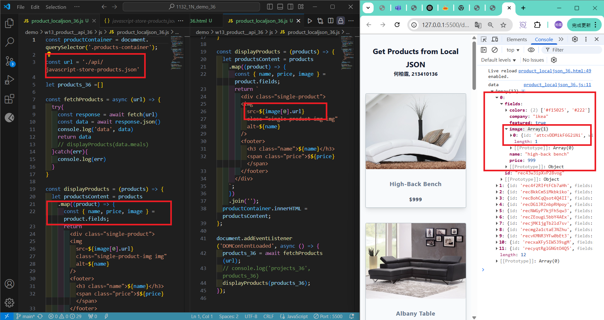
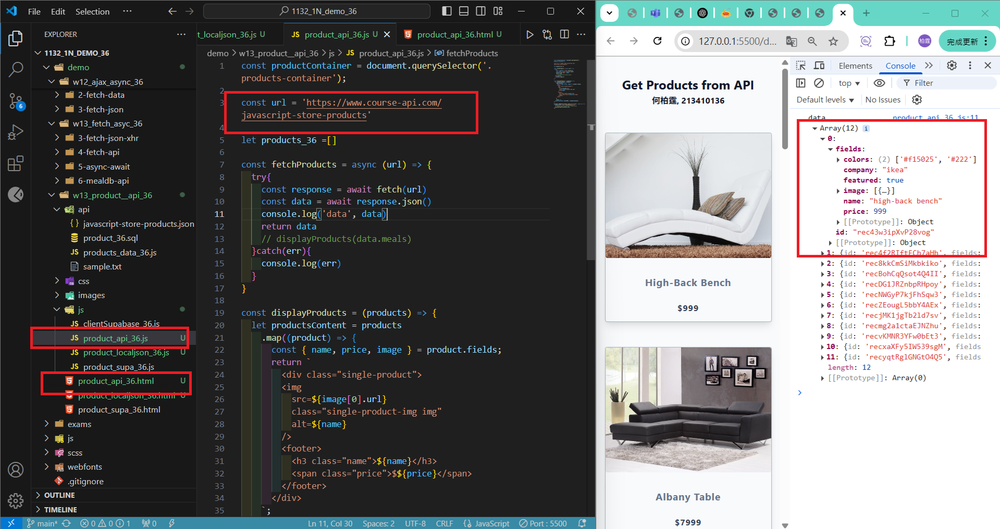
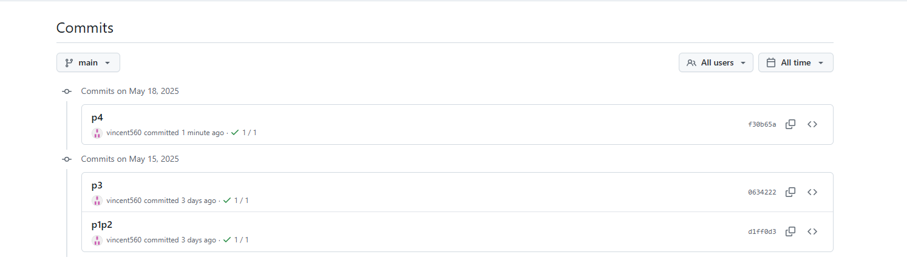

[My Github URL](https://github.com/vincent560/1132_1N_demo_36.git)

#### W13-P1: Use fetch API to replace xhr approach
 


#### W13-P2: Use Async Await to replace fetch API approach
 


````
d1ff0d3 vincent560      Thu May 15 19:43:21 2025 +0800  p1p2
````

#### W13-P3: Get meals about cheese from TheMealDB
 


````
0634222 vincent560      Thu May 15 20:26:02 2025 +0800  p3
````

#### W13-P4: Get Products from local json and from API
 
#### => Get products from local json
 

 
#### => Get products from API
 


````
f30b65a vincent560      Sun May 18 23:16:53 2025 +0800  p4
````
### W13-logs: git logs of W13
 
