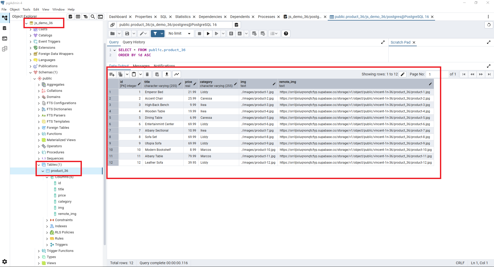
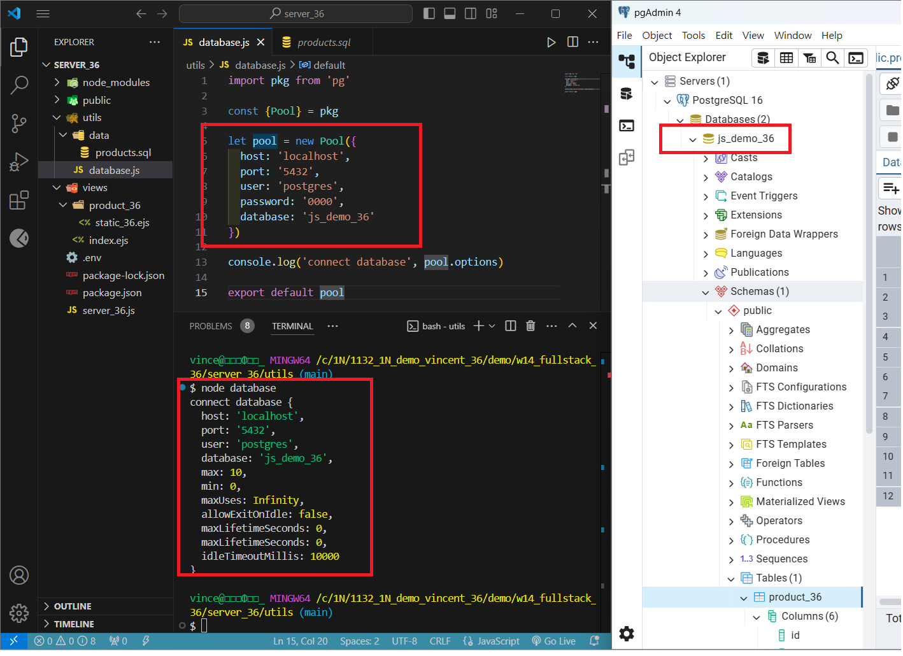
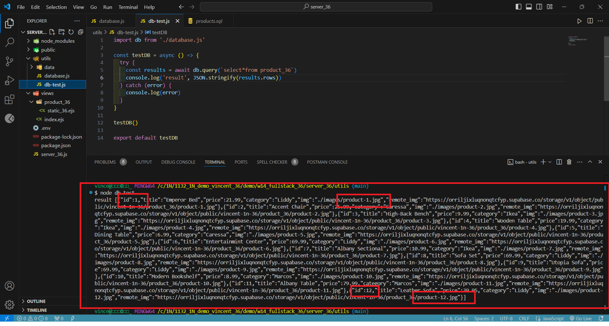

[My Github URL](https://github.com/vincent560/1132_1N_demo_36.git)

### W14-logs: git logs of W14
 


#### W14-P2: Show static products page
 
#### => show render page with data passed into ejs page
 

 
#### => show how the product-1.jpg can be accessed fro public directory as root directory
 


````
15171fc vincent560      Thu May 22 20:08:03 2025 +0800  p1p2
````
#### W14-P3: Create database js_demo_xx, table product_xx, and insert 12 data, write test code to get all products
 
#### => Create database js_demo_xx, table product_xx, and insert 12 data
 

 
#### => connect js_demo_xx database
 

 
#### => get all product data
 
