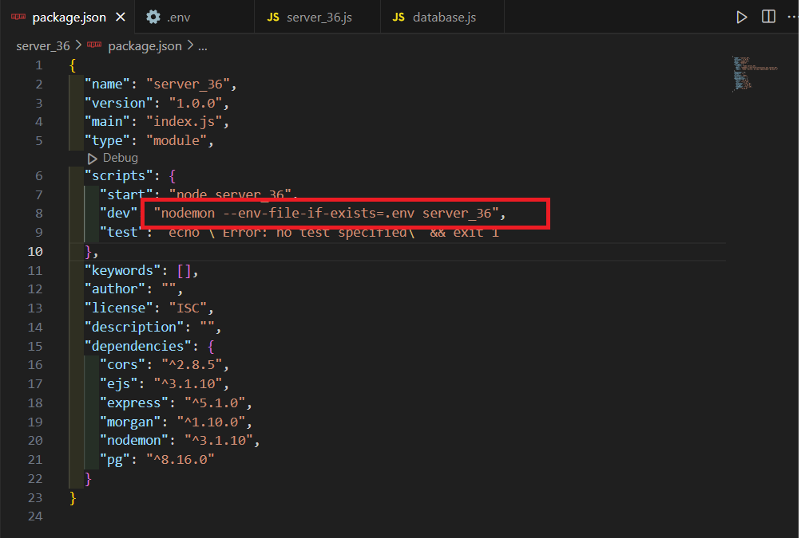
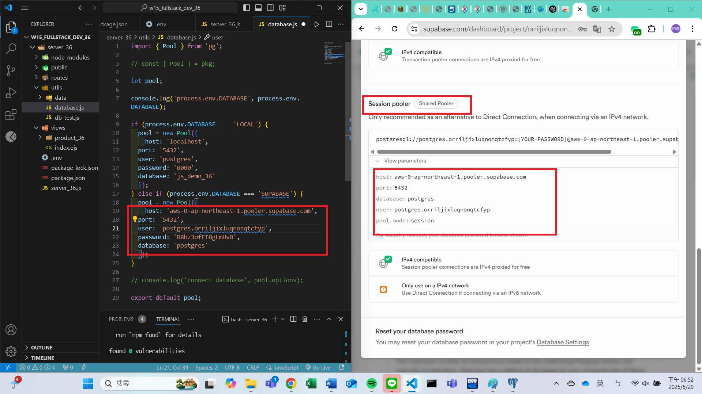
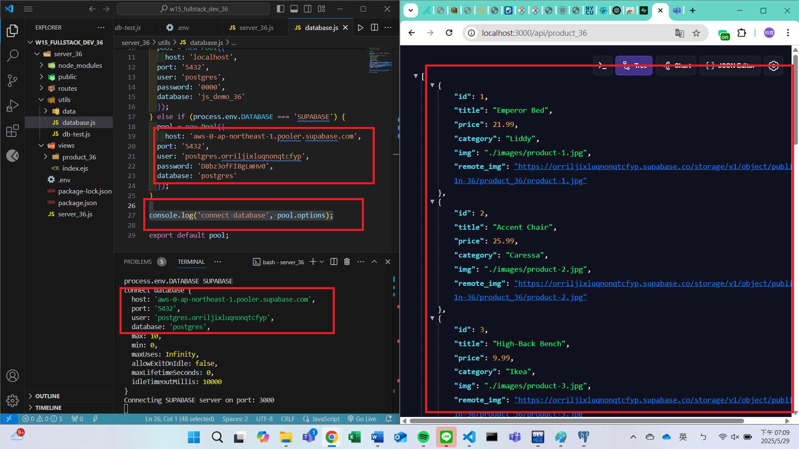
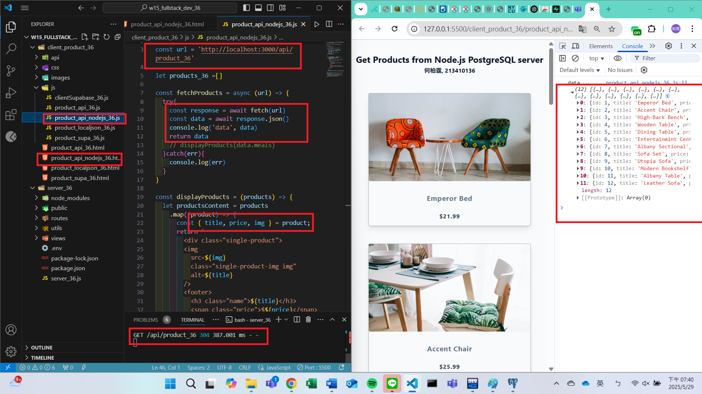
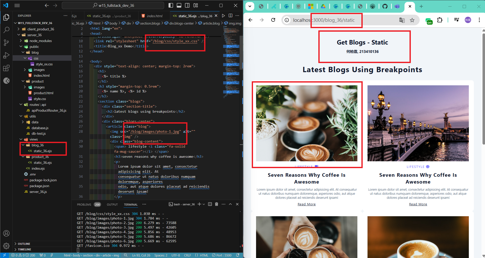
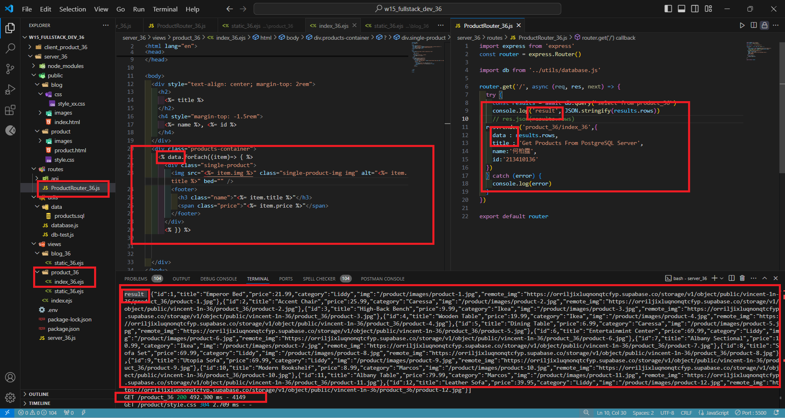
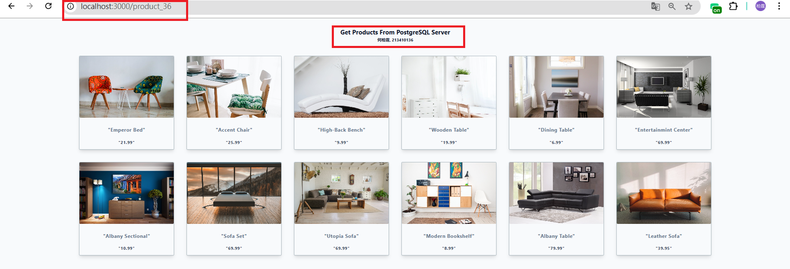

[My Github URL](https://github.com/vincent560/1132_1N_demo_36.git)

#### W15-P1: Set up and test connection to Supabase
 
#### => add support for .env in package.json
 

 
#### => Connection setting to Supabase
 

 
#### => For route /api/product_xx, get json from Supabase
 


#### W15-P2: Get /api/product_xx json and show it in the client side
 
#### =>
 


#### W15-P3: Show static page of blog theme
 


````
c45f594 vincent560      Sun Jun 1 18:56:47 2025 +0800   W15-P2 and P3
````

####　W15-P4: Implement route /product_xx to get json data from PostgreSQL server and display them in ejs file
 
#### => related code
 

 
#### => Chrome
 

 

### W15-logs: git logs of W15
 


````
83950eb vincent560      Thu May 29 19:13:55 2025 +0800  W15-P1: Set up and test connection to Supabase
````